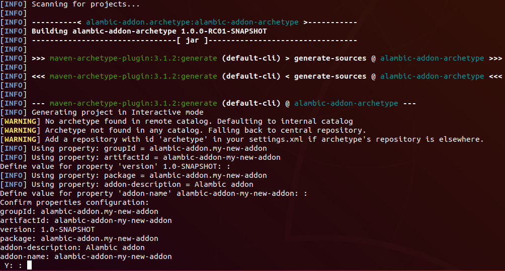

# ALAMBIC ADDON ARCHETYPE
This addon aims to ease the creation of a new addon of the [Alambic ETL](https://github.com/AC-Rennes-OpenSource/alambic) product.
Then, this is time saving as it helps focusing on the actual business operations to implement.

# Packaging
Run the command ```$ mvn clean install``` to package the project and install it within the local Maven repository.

The built ZIP archive stands for a maketplace than can be deployed via the Ansible scripts of the .

# How to create the skeleton of a new Alambic addon
## Execute the command
```
$ mvn archetype:generate -DarchetypeGroupId=alambic-addon.archetype -DarchetypeArtifactId=alambic-addon-archetype -DarchetypeVersion=<version of artefact from the local maven repository or Nexus server> -DgroupId=<Maven group identifier of the new addon> -DartifactId=<Maven artifact identifier of the new addon>
```

### Description
| Option | Description |
|---|---|
| archetypeVersion | **Mandatory :** the latest stable Alambic addon archetype version |
| groupId | **Mandatory :** the group identifier of the newly created Alambic addon (Maven - GAV) |
| artifactId | **Mandatory :** the artifact identifier of the newly created Alambic addon (Maven - GAV) |

### Example to create the Alambic addon "my-addon"
```
$ mvn archetype:generate -DarchetypeGroupId=alambic-addon.archetype -DarchetypeArtifactId=alambic-addon-archetype -DarchetypeVersion=1.0.0-RC01-SNAPSHOT -DgroupId=alambic-addon.my-new-addon -DartifactId=alambic-addon-my-new-addon
```

Here is the example console :



You will be prompted to type-in the following information :
- the version : the one typed-in the command line,
- the addon name : as default, is set with the artifact identifier typed-in the command line,
- the addon description : as default, the string "Alambic addon".
